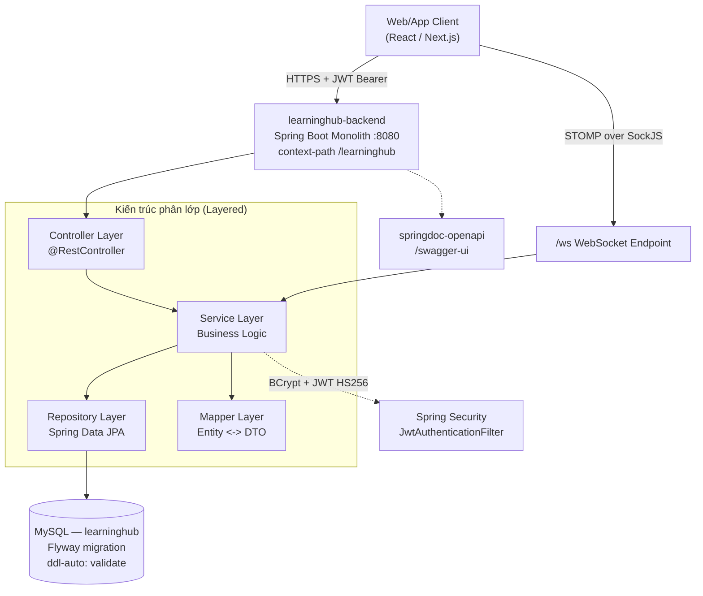
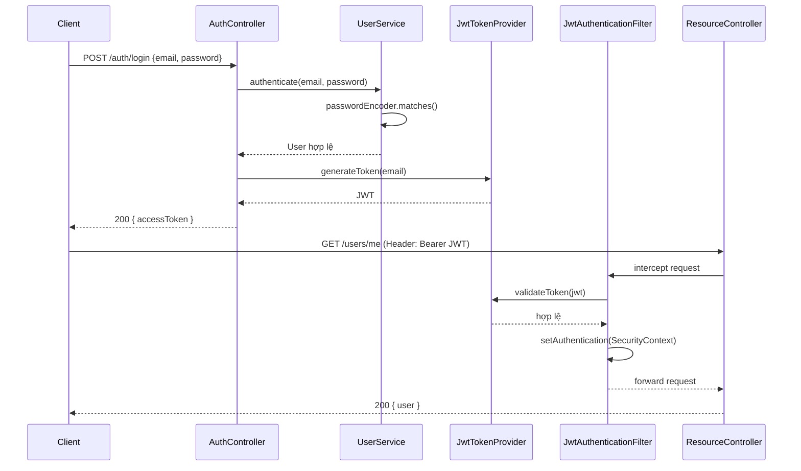
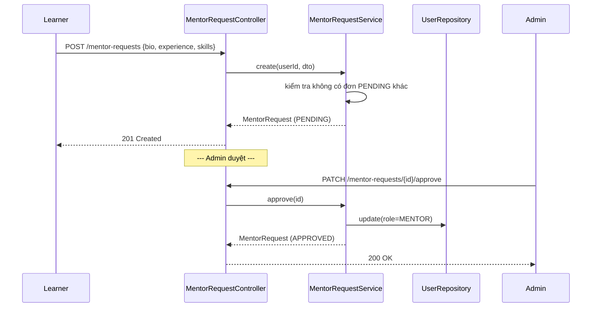
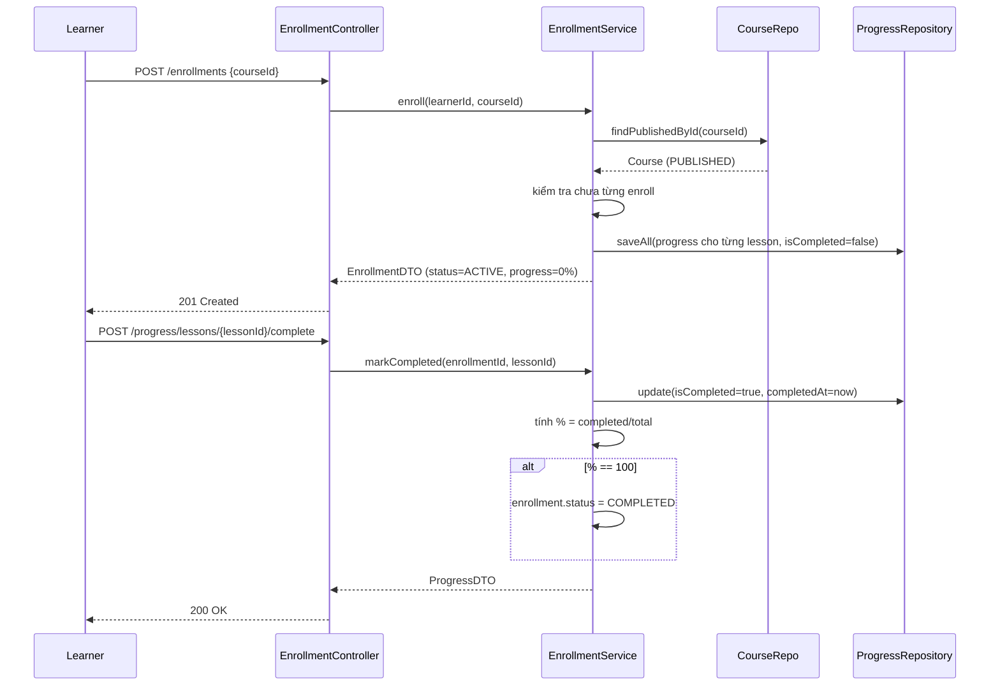

# TÀI LIỆU ĐẶC TẢ YÊU CẦU PHẦN MỀM

*Software Requirements Specification (SRS)*

─────────────────────────────────────

**LearningHub**

Hệ thống Học trực tuyến (Online Learning Platform)

*Kiến trúc Monolithic Layered · Spring Boot · JWT · WebSocket Chat*

─────────────────────────────────────

*Phiên bản 1.0 · Tháng 8/2026*

*Dành cho: BA · Backend Dev · Frontend Dev · QA/Tester*

| **Phiên bản** | **Ngày** | **Mô tả** |
|---|---|---|
| 0.1 | 08/2026 | Khởi tạo từ mã nguồn hiện có: module User hoàn chỉnh, hạ tầng chung (BaseEntity, ApiResponse, ErrorCode, JWT, Security, Swagger, WebSocket skeleton), Flyway V1 tạo đủ 9 bảng nghiệp vụ |
| 1.0 | 08/2026 | Bổ sung đặc tả đầy đủ 8 module nghiệp vụ (Auth, User & Mentor, Course, Enrollment & Progress, Review, Chat, Admin, Notification), RBAC, API spec, sequence diagram, lộ trình MVP → Phase 2 → Phase 3 |

## Mục lục

- Phần A — Tổng quan hệ thống: hiện trạng mã nguồn, mindmap, kiến trúc, chuẩn Response/Error Code
- Phần B — Phân quyền RBAC
- Phần C — Đặc tả nghiệp vụ chi tiết theo module
- Phần D — Thiết kế Frontend
- Phần E — Phi chức năng, lộ trình triển khai, phụ lục

---

# PHẦN A — TỔNG QUAN HỆ THỐNG

## A.1 Hiện trạng mã nguồn (đã có / chưa có)

| **Thành phần** | **Trạng thái** | **Ghi chú** |
|---|---|---|
| `BaseEntity` (createdAt, updatedAt, `@PrePersist/@PreUpdate`) | ✅ Đã có | Dùng chung cho mọi entity |
| `ApiResponse<T>` (code, message, result) | ✅ Đã có | Chuẩn response toàn hệ thống |
| `ErrorCode` + `AppException` + `GlobalExceptionHandler` | ✅ Đã có | Xử lý lỗi tập trung |
| `SecurityConfig` + `JwtTokenProvider` + `JwtAuthenticationFilter` | ✅ Đã có | JWT HS256, stateless, BCrypt |
| `SwaggerConfig` (OpenAPI + Bearer) | ✅ Đã có | |
| `WebSocketConfig` (`/ws`, SockJS, STOMP `/app`, `/topic`, `/queue`, `/user`) | ✅ Đã có (khung) | Chưa có Controller xử lý message |
| Module **User**: Entity, Repository, Mapper, Service, Controller | ✅ Đã có đầy đủ | CRUD + `/users/me`, phân quyền `@PreAuthorize` |
| Flyway `V1__init_db.sql`: `users`, `mentor_requests`, `courses`, `chapters`, `lessons`, `enrollments`, `progress`, `reviews`, `messages` | ✅ Đã có (DDL) | Toàn bộ cấu trúc bảng đã được thiết kế sẵn |
| Module **Auth** (login/register/refresh) | ⚠️ Chưa có Controller | `SecurityConfig` đã chừa route `/auth/**` permitAll, cần bổ sung |
| Module **Mentor Request** | ❌ Chưa có | Bảng đã có, chưa có code |
| Module **Course / Chapter / Lesson** | ❌ Chưa có | Bảng đã có, chưa có code |
| Module **Enrollment / Progress** | ❌ Chưa có | Bảng đã có, chưa có code |
| Module **Review** | ❌ Chưa có | Bảng đã có, chưa có code |
| Module **Chat** (message persist + STOMP handler) | ❌ Chưa có | Bảng `messages` đã có, WebSocket config đã có khung |
| Module **Admin** (duyệt mentor, khoá user, kiểm duyệt course) | ❌ Chưa có | Dùng lại quyền `ADMIN` trên các API hiện có |
| **Notification** (đa kênh) | ❌ Chưa có — thuộc Phase 2 | |
| **Payment thật** | ❌ Chưa có — thuộc Phase 2, MVP có thể mock | |

> Tài liệu này giữ nguyên các quyết định thiết kế đã tồn tại trong code (package `com.ex.learninghub`, `ApiResponse`, `ErrorCode`, cấu trúc bảng V1) và đặc tả **đầy đủ** các module còn thiếu để hoàn thiện MVP, đồng thời vạch rõ ranh giới Phase 2/Phase 3 để tránh phình phạm vi.

## A.2 Bối cảnh & mục tiêu

LearningHub là nền tảng học trực tuyến theo mô hình **mentor tạo khoá học – learner đăng ký học**, có 3 vai trò: `LEARNER`, `MENTOR`, `ADMIN`. Mục tiêu MVP: chứng minh được **một luồng người dùng hoàn chỉnh, chạy thật end-to-end**, không phải tập hợp CRUD rời rạc:

> Đăng ký → Đăng nhập → Xem khoá học → Đăng ký học (enroll) → Học bài (lesson) → Đánh dấu hoàn thành → Xem % tiến độ → Chat với mentor → Đánh giá khoá học.

Những hạng mục **cố tình để ngoài MVP** (Phase 2/3), theo đúng định hướng ban đầu: thanh toán thật, refund, AI recommendation, analytics nâng cao, discount, notification đa kênh, tách microservice, tối ưu scale (Redis cache, message queue).

## A.3 Kiến trúc tổng thể (Monolithic Layered)



*Hình A.1 — Kiến trúc tổng thể (đơn khối, phân lớp rõ ràng — phù hợp quy mô MVP, có thể tách microservice ở Phase 3 nếu cần)*

**Vì sao Monolith cho MVP:** hệ thống hiện có quy mô 1 team nhỏ, 3 vai trò, ~9 bảng dữ liệu. Tách microservice ở giai đoạn này làm tăng chi phí hạ tầng (nhiều DB, service discovery, gateway) mà chưa cần thiết. Việc tách theo package `modules/{auth, user, course, enrollment, chat, review, admin}` ngay từ đầu giúp **dễ dàng bóc tách thành microservice sau này** nếu tải tăng (đúng tinh thần "modular monolith").

## A.4 Chuẩn Response & Error Code

Toàn bộ API trả về theo `ApiResponse<T>` đã có sẵn trong code:

```json
{ "code": 200, "message": "...", "result": { } }
```

| **ErrorCode** | **HTTP** | **Mô tả** | **Trạng thái** |
|---|---|---|---|
| UNCATEGORIZED_EXCEPTION | 500 | Lỗi ngoài dự kiến | ✅ Đã có |
| KEY_INVALID | 400 | Message key không hợp lệ | ✅ Đã có |
| UNAUTHORIZED | 401 | Chưa xác thực | ✅ Đã có |
| FORBIDDEN | 403 | Không đủ quyền | ✅ Đã có |
| EMAIL_REQUIRED / EMAIL_EXISTS | 400 / 400 | Validate đăng ký | ✅ Đã có |
| USER_NOT_FOUND | 404 | | ✅ Đã có |
| INVALID_CREDENTIALS | 400 | Sai email/password khi login | ✅ Đã có (đang chưa dùng — cần AuthController) |
| COURSE_NOT_FOUND | 404 | | ✅ Đã có (đang chưa dùng) |
| CHAPTER_NOT_FOUND | 404 | | ✅ Đã có (đang chưa dùng) |
| LESSON_NOT_FOUND | 404 | | ✅ Đã có (đang chưa dùng) |
| ENROLLMENT_EXISTS | 400 | Learner đã đăng ký khoá học này | ✅ Đã có (đang chưa dùng) |
| ENROLLMENT_NOT_FOUND | 404 | | ✅ Đã có (đang chưa dùng) |
| PROGRESS_NOT_FOUND | 404 | | ✅ Đã có (đang chưa dùng) |
| MENTOR_REQUEST_NOT_FOUND | 404 | | ✅ Đã có (đang chưa dùng) |
| MENTOR_REQUEST_PENDING | 400 | Đã có đơn đang chờ duyệt | ✅ Đã có (đang chưa dùng) |
| REVIEW_EXISTS | 400 | Đã review khoá học này rồi | ✅ Đã có (đang chưa dùng) |
| REVIEW_NOT_FOUND | 404 | | ✅ Đã có (đang chưa dùng) |
| CHAT_ROOM_NOT_FOUND | 404 | | ✅ Đã có (đang chưa dùng) |
| COURSE_NOT_PUBLISHED *(mới)* | 400 | Course chưa PUBLISHED, không thể enroll | 🆕 Cần bổ sung |
| LESSON_LOCKED *(mới)* | 400 | Chưa hoàn thành bài trước (nếu bật học tuần tự) | 🆕 Cần bổ sung |

## A.5 Luồng xác thực JWT (đã có hạ tầng, cần bổ sung Controller)



*Hình A.2 — Luồng đăng nhập và xác thực request (dùng lại toàn bộ hạ tầng JWT hiện có)*

---

# PHẦN B — THIẾT KẾ PHÂN QUYỀN (RBAC)

## B.1 Vai trò

| **Role** | **Mô tả** |
|---|---|
| `LEARNER` | Người học: xem/đăng ký khoá học, học bài, chat, đánh giá |
| `MENTOR` | Người dạy: tạo/quản lý khoá học của mình, xem learner đã enroll, chat |
| `ADMIN` | Quản trị: duyệt mentor, kiểm duyệt khoá học, quản lý user, xem báo cáo |

`UserStatus`: `ACTIVE` (dùng bình thường) · `PENDING` (tài khoản mới / đang chờ duyệt mentor) · `BANNED` (bị khoá, không login được — `UserPrincipal.isAccountNonLocked()` đã xử lý) · `DELETED` (xoá mềm).

## B.2 Ma trận phân quyền

| **Chức năng** | **Endpoint** | **LEARNER** | **MENTOR** | **ADMIN** |
|---|---|---|---|---|
| Đăng ký tài khoản | POST /users | ✔ (public) | ✔ (public) | ✔ (public) |
| Đăng nhập / refresh | POST /auth/login\|refresh | ✔ | ✔ | ✔ |
| Xem/sửa hồ sơ chính mình | GET/PUT /users/me | ✔ | ✔ | ✔ |
| Xem danh sách user | GET /users | ✗ | ✗ | ✔ |
| Khoá / mở khoá user | PATCH /users/{id}/status | ✗ | ✗ | ✔ |
| Gửi đơn đăng ký làm mentor | POST /mentor-requests | ✔ | ✗ | ✗ |
| Duyệt / từ chối đơn mentor | PATCH /mentor-requests/{id} | ✗ | ✗ | ✔ |
| Tạo / sửa / xoá khoá học | POST\|PUT\|DELETE /courses | ✗ | ✔ (của mình) | ✔ |
| Xem danh sách/chi tiết khoá học đã PUBLISHED | GET /courses | ✔ | ✔ | ✔ |
| Duyệt khoá học (DRAFT → PUBLISHED) | PATCH /courses/{id}/status | ✗ | ✗ | ✔ |
| CRUD chapter/lesson của khoá học mình dạy | POST\|PUT\|DELETE /courses/{id}/chapters... | ✗ | ✔ (của mình) | ✔ |
| Đăng ký học (enroll) | POST /enrollments | ✔ | ✗ | ✗ |
| Đánh dấu hoàn thành bài học | POST /progress/{lessonId}/complete | ✔ (đã enroll) | ✗ | ✗ |
| Xem tiến độ khoá học | GET /enrollments/{id}/progress | ✔ (chính mình) | ✔ (learner của mình) | ✔ |
| Gửi / xem tin nhắn chat | STOMP /app/chat.send, GET /messages | ✔ | ✔ | ✔ (hỗ trợ) |
| Viết đánh giá khoá học | POST /reviews | ✔ (đã hoàn thành) | ✗ | ✗ |
| Xem đánh giá | GET /courses/{id}/reviews | ✔ | ✔ | ✔ |
| Xoá đánh giá vi phạm | DELETE /reviews/{id} | ✗ (chỉ của mình) | ✗ | ✔ |
| Dashboard thống kê | GET /admin/dashboard | ✗ | ✗ | ✔ |

---

# PHẦN C — ĐẶC TẢ NGHIỆP VỤ CHI TIẾT THEO MODULE

## C.1 Module 1: Auth (🆕 cần bổ sung Controller)

### C.1.1 API

| **Method + Endpoint** | **Mô tả** | **HTTP / Lỗi** |
|---|---|---|
| POST /auth/login | Đăng nhập bằng email/password, trả JWT | 200; Error: INVALID_CREDENTIALS |
| POST /auth/refresh | Làm mới access token bằng refresh token | 200; Error: UNAUTHORIZED |
| POST /auth/logout | Vô hiệu hoá refresh token hiện tại | 200 |
| POST /users | Đăng ký tài khoản (đã có sẵn, permitAll) | 201; Error: EMAIL_EXISTS |

### C.1.2 Quy tắc nghiệp vụ

**FR-AUTH-01 — Đăng ký & đăng nhập**
- Mật khẩu mã hoá bằng `BCryptPasswordEncoder` (đã có).
- User mới mặc định `role = LEARNER`, `status = ACTIVE` (đã đúng theo `UserServiceImpl.createUser`).
- Login thất bại 5 lần liên tiếp trong 15 phút → tạm khoá đăng nhập bằng email đó (chống brute-force) — **Phase 2**, MVP chỉ trả `INVALID_CREDENTIALS`.
- Access token JWT (HS256) hết hạn theo `jwt.expiration` (đã cấu hình). Refresh token: cần bổ sung bảng `refresh_tokens (id, user_id, token, expires_at, revoked)` hoặc dùng token luân phiên đơn giản lưu Redis (Phase 2); MVP có thể dùng access token dài hạn hơn (vd 24h) để giảm độ phức tạp.

## C.2 Module 2: User & Mentor Onboarding

### C.2.1 Bảng dữ liệu (đã có)

| **Bảng** | **Trường chính** | **Ghi chú** |
|---|---|---|
| users | id, email, password, fullName, avatarUrl, role, status, createdAt, updatedAt | ✅ Đã có |
| mentor_requests | id, userId, bio, experience, skills, status, rejectionReason, createdAt, updatedAt | ✅ Đã có bảng, chưa có code |

### C.2.2 API — User (đã có) + Mentor Request (🆕)

| **Method + Endpoint** | **Mô tả** | **Actor** | **Trạng thái** |
|---|---|---|---|
| POST /users | Đăng ký | Public | ✅ Đã có |
| GET /users | Danh sách user | ADMIN | ✅ Đã có |
| GET /users/{id} | Chi tiết user | Chính mình / ADMIN / MENTOR | ✅ Đã có |
| GET /users/me | Hồ sơ cá nhân | Đã đăng nhập | ✅ Đã có |
| PUT /users/{id} | Cập nhật hồ sơ | Chính mình / ADMIN | ✅ Đã có |
| DELETE /users/{id} | Xoá mềm (status=DELETED) | ADMIN | ✅ Đã có |
| POST /mentor-requests | Gửi đơn xin làm mentor (bio, experience, skills) | LEARNER | 🆕 |
| GET /mentor-requests | Danh sách đơn (lọc theo status) | ADMIN | 🆕 |
| GET /mentor-requests/me | Xem đơn của chính mình | LEARNER | 🆕 |
| PATCH /mentor-requests/{id}/approve | Duyệt đơn → đổi `users.role = MENTOR` | ADMIN | 🆕 |
| PATCH /mentor-requests/{id}/reject | Từ chối (kèm `rejectionReason`) | ADMIN | 🆕 |

### C.2.3 Quy tắc nghiệp vụ

**FR-USER-01 — Đăng ký làm Mentor**
- Một learner chỉ được có **1 đơn đang PENDING** tại một thời điểm (Error: `MENTOR_REQUEST_PENDING`).
- Khi ADMIN duyệt: cập nhật `mentor_requests.status = APPROVED` **và** `users.role = MENTOR` trong cùng 1 transaction.
- Khi từ chối: bắt buộc nhập `rejectionReason`, learner được phép gửi lại đơn mới.


*Hình C.1 — Sequence: Đăng ký & duyệt Mentor*

## C.3 Module 3: Course, Chapter, Lesson (🆕)

### C.3.1 Bảng dữ liệu (đã có)

| **Bảng** | **Trường chính** | **Ghi chú** |
|---|---|---|
| courses | id, title, description, price, mentorId, status, createdAt, updatedAt | `status`: DRAFT / PUBLISHED / ARCHIVED (🆕 enum cần bổ sung) |
| chapters | id, courseId, title, sortOrder, createdAt, updatedAt | Sắp xếp theo `sortOrder` |
| lessons | id, chapterId, title, content, videoUrl, duration, sortOrder, createdAt, updatedAt | `content` = text/markdown bài học |

### C.3.2 API

| **Method + Endpoint** | **Mô tả** | **Actor** | **HTTP / Lỗi** |
|---|---|---|---|
| POST /courses | Tạo khoá học (status=DRAFT) | MENTOR | 201 |
| GET /courses | Tìm kiếm: keyword, status — chỉ trả PUBLISHED cho LEARNER | Public/LEARNER/MENTOR/ADMIN | 200 |
| GET /courses/{id} | Chi tiết khoá học (kèm chapters + lessons) | Public (nếu PUBLISHED) | 200; Error: COURSE_NOT_FOUND |
| PUT /courses/{id} | Cập nhật thông tin | MENTOR (chủ course) / ADMIN | 200 |
| PATCH /courses/{id}/status | Đổi trạng thái (submit duyệt / duyệt / gỡ) | MENTOR (submit) / ADMIN (duyệt) | 200 |
| DELETE /courses/{id} | Xoá (chỉ khi chưa có enrollment) | MENTOR (chủ) / ADMIN | 200 |
| POST /courses/{id}/chapters | Thêm chương | MENTOR (chủ course) | 201 |
| PUT /courses/{id}/chapters/{chapterId} | Sửa chương / đổi sortOrder | MENTOR (chủ course) | 200; Error: CHAPTER_NOT_FOUND |
| DELETE /courses/{id}/chapters/{chapterId} | Xoá chương | MENTOR (chủ course) | 200 |
| POST /chapters/{chapterId}/lessons | Thêm bài học | MENTOR (chủ course) | 201 |
| PUT /lessons/{id} | Sửa bài học | MENTOR (chủ course) | 200; Error: LESSON_NOT_FOUND |
| DELETE /lessons/{id} | Xoá bài học | MENTOR (chủ course) | 200 |

### C.3.3 Quy tắc nghiệp vụ

**FR-COURSE-01 — Vòng đời khoá học**
- Course tạo mới ở trạng thái `DRAFT`, chỉ mentor sở hữu (`mentorId == principal.id`) mới sửa được (kiểm tra ở Service, tương tự cách `@PreAuthorize` đang dùng cho module User).
- Mentor bấm "gửi duyệt" → `DRAFT → PENDING_REVIEW`; Admin duyệt → `PUBLISHED`; Admin có thể `ARCHIVED` (gỡ khỏi catalog) bất kỳ lúc nào.
- Chỉ course `PUBLISHED` mới hiển thị cho LEARNER và cho phép enroll (Error: `COURSE_NOT_PUBLISHED`).
- Xoá course chỉ được phép khi **chưa có enrollment nào** — nếu có, chỉ cho phép chuyển `ARCHIVED`.

**FR-COURSE-02 — Chapter/Lesson**
- `sortOrder` quyết định thứ tự hiển thị trong chương trình học; unique trong phạm vi course (chapter) / chapter (lesson).
- MVP: `content` lưu text/markdown, `videoUrl` là link ngoài (YouTube/Vimeo) — **không tự host video** (tránh phình MVP bằng hạ tầng streaming riêng, để Phase 2/3 nếu cần).

## C.4 Module 4: Enrollment & Progress (🆕 — cốt lõi giá trị sản phẩm)

### C.4.1 Bảng dữ liệu (đã có)

| **Bảng** | **Trường chính** | **Ghi chú** |
|---|---|---|
| enrollments | id, learnerId, courseId, status, enrolledAt, completedAt | Unique (learnerId, courseId) |
| progress | id, enrollmentId, lessonId, isCompleted, completedAt, updatedAt | Unique (enrollmentId, lessonId) |

### C.4.2 API

| **Method + Endpoint** | **Mô tả** | **Actor** | **HTTP / Lỗi** |
|---|---|---|---|
| POST /enrollments | Đăng ký học 1 khoá (courseId) | LEARNER | 201; Error: ENROLLMENT_EXISTS, COURSE_NOT_PUBLISHED |
| GET /enrollments/me | Danh sách khoá đang học của chính mình | LEARNER | 200 |
| GET /enrollments/{id} | Chi tiết 1 lượt học (kèm % tiến độ) | Chính learner / MENTOR (chủ course) / ADMIN | 200; Error: ENROLLMENT_NOT_FOUND |
| POST /progress/lessons/{lessonId}/complete | Đánh dấu hoàn thành 1 bài học | LEARNER (đã enroll) | 200; Error: PROGRESS_NOT_FOUND |
| GET /enrollments/{id}/progress | Danh sách bài học + trạng thái hoàn thành | LEARNER (chính mình) / MENTOR / ADMIN | 200 |
| GET /courses/{id}/students | Danh sách learner đã enroll khoá học của mình | MENTOR (chủ course) | 200 |

### C.4.3 Quy tắc nghiệp vụ

**FR-ENROLL-01 — Đăng ký học**
- Không cho enroll trùng (unique constraint `learnerId+courseId` → `ENROLLMENT_EXISTS`).
- Khi enroll: hệ thống tự sinh sẵn các bản ghi `progress` cho toàn bộ lesson thuộc course (isCompleted=false) để tính % tiến độ đơn giản (COUNT completed / COUNT total).
- `status` enrollment: `ACTIVE` khi mới tạo → `COMPLETED` khi 100% lesson hoàn thành (tự động, set `completedAt`).

**FR-ENROLL-02 — Đánh dấu hoàn thành bài học**
- Chỉ learner đang sở hữu enrollment đó được đánh dấu (kiểm tra qua `enrollmentId` liên kết đến `learnerId == principal.id`).
- Sau khi cập nhật `progress`, Service tính lại % và tự chuyển `enrollment.status = COMPLETED` nếu đạt 100% — trigger để module Review cho phép viết đánh giá (`FR-REVIEW-01`).
- MVP **không bắt buộc học tuần tự** (learner có thể học lesson bất kỳ thứ tự). Học tuần tự bắt buộc (`LESSON_LOCKED`) là tuỳ chọn Phase 2.


*Hình C.2 — Sequence: Đăng ký học & theo dõi tiến độ (luồng cốt lõi MVP)*

## C.5 Module 5: Chat (🆕 — khung WebSocket đã có, cần bổ sung xử lý)

### C.5.1 Bảng dữ liệu (đã có)

| **Bảng** | **Trường chính** | **Ghi chú** |
|---|---|---|
| messages | id, senderId, receiverId, content, isRead, createdAt | Chat 1-1 giữa learner ↔ mentor trong ngữ cảnh 1 course |

### C.5.2 API / WebSocket

| **Kênh** | **Mô tả** | **Actor** |
|---|---|---|
| `SEND /app/chat.send` | Gửi tin nhắn `{receiverId, courseId, content}` | LEARNER, MENTOR |
| `SUBSCRIBE /user/queue/messages` | Nhận tin nhắn realtime (đã cấu hình `setUserDestinationPrefix("/user")`) | LEARNER, MENTOR |
| GET /messages?withUserId=&courseId= | Lịch sử chat (phân trang, để load khi mở lại) | LEARNER, MENTOR |
| PATCH /messages/{id}/read | Đánh dấu đã đọc | Người nhận |

### C.5.3 Quy tắc nghiệp vụ

**FR-CHAT-01 — Chat theo course**
- Chat chỉ mở giữa learner và mentor **của khoá học mà learner đã enroll** (kiểm tra qua bảng `enrollments`) — tránh spam ngoài phạm vi.
- Message persist ngay khi gửi (`messages` table) trước khi broadcast qua STOMP, đảm bảo không mất dữ liệu nếu người nhận offline.
- MVP: chat 1-1 văn bản thuần, không đính kèm file, không group chat (để Phase 2).

## C.6 Module 6: Review (🆕)

### C.6.1 Bảng dữ liệu (đã có)

| **Bảng** | **Trường chính** | **Ghi chú** |
|---|---|---|
| reviews | id, courseId, learnerId, rating, comment, createdAt, updatedAt | Unique (courseId, learnerId) |

### C.6.2 API

| **Method + Endpoint** | **Mô tả** | **Actor** | **HTTP / Lỗi** |
|---|---|---|---|
| POST /courses/{id}/reviews | Viết đánh giá (rating 1–5, comment) | LEARNER (đã COMPLETED) | 201; Error: REVIEW_EXISTS |
| GET /courses/{id}/reviews | Danh sách đánh giá + rating trung bình | Public | 200 |
| PUT /reviews/{id} | Sửa đánh giá của chính mình | LEARNER (chủ) | 200; Error: REVIEW_NOT_FOUND |
| DELETE /reviews/{id} | Xoá đánh giá | Chính chủ / ADMIN (vi phạm) | 200 |

### C.6.3 Quy tắc nghiệp vụ

**FR-REVIEW-01 — Điều kiện đánh giá**
- Chỉ learner có `enrollment.status = COMPLETED` với course đó mới được review (đảm bảo review thực chất, gắn với `FR-ENROLL-02`).
- Mỗi learner chỉ review 1 lần / course (được sửa lại, không tạo trùng).
- `courses.averageRating` (cột tính toán hoặc query aggregate) hiển thị trên course catalog.

## C.7 Module 7: Admin (🆕 — tận dụng quyền có sẵn)

### C.7.1 API

| **Method + Endpoint** | **Mô tả** | **Actor** |
|---|---|---|
| GET /admin/dashboard | Số liệu tổng quan: tổng user, tổng course PUBLISHED, tổng enrollment, đơn mentor chờ duyệt | ADMIN |
| PATCH /users/{id}/status | Khoá/mở khoá tài khoản (đổi `status`) | ADMIN |
| PATCH /courses/{id}/status | Kiểm duyệt khoá học | ADMIN |
| PATCH /mentor-requests/{id}/approve\|reject | Duyệt mentor | ADMIN |
| DELETE /reviews/{id} | Gỡ đánh giá vi phạm | ADMIN |

### C.7.2 Dashboard (MVP tối thiểu)

- 4 cards: Tổng người dùng, Tổng khoá học đã publish, Tổng lượt enroll, Đơn mentor đang chờ duyệt.
- Không cần biểu đồ nâng cao/BI ở MVP — để Phase 2 (Analytics dashboard nằm trong danh sách "không phải MVP" theo định hướng ban đầu).

## C.8 Module 8: Notification — **Phase 2 (ngoài MVP)**

Ghi chú để không quên khi mở rộng: in-app notification khi (1) đơn mentor được duyệt/từ chối, (2) course được duyệt publish, (3) có tin nhắn mới, (4) có review mới cho course của mentor. MVP thay thế tạm bằng việc client tự poll hoặc hiển thị trực tiếp qua response của các API tương ứng.

---

# PHẦN D — THIẾT KẾ FRONTEND

## D.1 Danh sách màn hình theo vai trò

| **Vai trò** | **Màn hình** |
|---|---|
| Public/Learner | Trang chủ & danh sách khoá học, Chi tiết khoá học, Đăng ký/Đăng nhập |
| Learner | Dashboard cá nhân (khoá đang học, % tiến độ), Màn hình học bài (video/nội dung + đánh dấu hoàn thành), Chat với mentor, Viết đánh giá, Hồ sơ cá nhân, Form đăng ký làm mentor |
| Mentor | Dashboard khoá học của tôi, Tạo/sửa khoá học, Trình soạn Chapter/Lesson (kéo thả `sortOrder`), Danh sách learner đã enroll, Chat với learner |
| Admin | Dashboard tổng quan, Quản lý người dùng (khoá/mở khoá), Duyệt đơn Mentor, Kiểm duyệt khoá học, Quản lý đánh giá vi phạm |

## D.2 Kiến trúc kỹ thuật FE (đề xuất)

- Framework: React/Next.js, gọi API qua Axios + interceptor gắn JWT Bearer tự động, refresh token khi 401.
- State: Context/Zustand cho auth + role-based routing (ẩn/hiện menu theo `role`, tương tự cấu trúc route theo role đã quen thuộc).
- Realtime chat: `@stomp/stompjs` + `sockjs-client` kết nối `/ws`, subscribe `/user/queue/messages`.
- Form: React Hook Form + validate khớp với `@NotBlank`/`@Email` phía BE để hiển thị lỗi nhất quán với `ErrorCode`.

---

# PHẦN E — PHI CHỨC NĂNG & LỘ TRÌNH TRIỂN KHAI

## E.1 Yêu cầu phi chức năng

| **Hạng mục** | **Yêu cầu MVP** |
|---|---|
| Bảo mật | JWT HS256 + BCrypt (đã có); HTTPS ở môi trường production; không log password/token |
| Hiệu năng | API chính (course list, enroll, progress) phản hồi < 500ms với dữ liệu MVP scale (~vài nghìn user) |
| Khả năng mở rộng | Modular monolith theo package `modules/*` để dễ tách microservice khi cần (Phase 3) |
| Logging | Log lỗi tập trung qua `GlobalExceptionHandler` (đã có); bổ sung log request ở tầng Controller cho audit cơ bản |
| Migration | Mọi thay đổi schema qua Flyway, **không insert dữ liệu demo bằng migration** — tạo qua UI/API/seed script riêng cho môi trường dev |

## E.2 Lộ trình triển khai

**Phase 1 — MVP (mục tiêu hiện tại)**
1. Bổ sung `AuthController` (login/refresh/logout) dùng lại `JwtTokenProvider` sẵn có.
2. Module Course/Chapter/Lesson (CRUD + vòng đời DRAFT→PENDING_REVIEW→PUBLISHED).
3. Module Enrollment & Progress (luồng cốt lõi).
4. Module Chat cơ bản (STOMP handler + persist `messages`).
5. Module Review đơn giản (rating + comment).
6. Module Mentor Request + Admin tối thiểu (duyệt mentor, khoá user, duyệt course).
7. Kiểm thử end-to-end đúng 1 user journey: đăng ký → login → xem course → enroll → học → hoàn thành → chat → review.

**Phase 2 — Enhancement**
- Payment thật (tích hợp cổng thanh toán) thay cho mock.
- Refund system.
- Notification đa kênh (in-app + email SMTP).
- Admin dashboard nâng cao (biểu đồ, filter).
- Discount/coupon cho khoá học.
- Học tuần tự bắt buộc (`LESSON_LOCKED`), rate-limit login.

**Phase 3 — Scale/Advanced**
- Tách microservice theo module (auth-service, course-service, learning-service, chat-service...) nếu tải tăng.
- Event-driven (Kafka/RabbitMQ) cho notification, đồng bộ dữ liệu liên module.
- Redis cache cho course catalog, session/token blacklist.
- AI recommendation khoá học.

## E.3 Phụ lục — Tổng hợp Enum cần bổ sung

| **Enum** | **Giá trị** | **Ghi chú** |
|---|---|---|
| `Role` (đã có) | LEARNER, MENTOR, ADMIN | |
| `UserStatus` (đã có) | ACTIVE, BANNED, PENDING, DELETED | |
| `CourseStatus` 🆕 | DRAFT, PENDING_REVIEW, PUBLISHED, ARCHIVED | |
| `EnrollmentStatus` 🆕 | ACTIVE, COMPLETED, CANCELLED | |
| `MentorRequestStatus` 🆕 | PENDING, APPROVED, REJECTED | |
